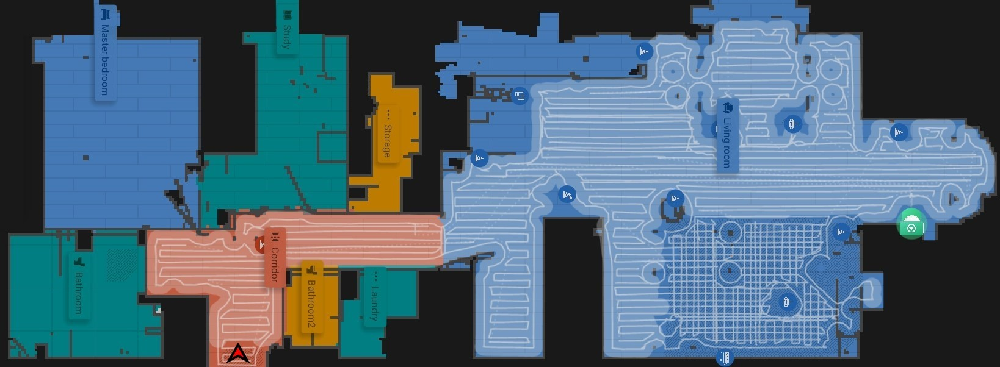

# mi casa es su casa!

> Make yourself at home, there is no concept of guests in the house. This also means you have to take care of yourselves.

Roborock saves the day. This is the rough floor plan.

- You can find _clean sheets_ in the drawers under the sofa bed in the study/guest room. Also in the master bedroom.
- _Ceiling light in the master bathroom_ is sensored. Switch controls the sensor. So, you don't actually need to do anything with the switch. Leave it on. There is another one by the mirror, it's manual.
    - _Clean towels_ are in the braided storage bags. 
- There is a _bidet_ in the second toilet, if you need it.
- My lovely cats have an automated food dispenser and a water fountain. So, they can pretty much manage themselves. They need the occasional petting though, don't forget!
    - Tuxedo one is _Java_, three legged bastard is _Pixel_. They indentify themselves as he and she, respectively.
    - Please _keep the doors closed_, if you don't want the cats to organize a reconnaissance mission. I usually do, don't come to me complaining, it's their house ;)
- Suit yourself with whatever you find in the fridge and the closets, no need to ask.
- Closets in the laundry room must have everything you need like tablets, softener, color cathers etc. There is also an extra bag to throw your dirty things in.
- Tap water is perfectly drinkable, you can use the pitcher as well.
- Check kitchenette side drawers to find utilies. There is an inner drawer in the top row - middle one for utensils.
- _Wifi password_ is pinned onto the kitchen board. 
- There are thermostats in the rooms, but it takes some time to get there since the flat is ground-heated.
- _Bikes_ have a separate section in the garage, on floor -1. You can park yours as well, or use mine when not in use. You will need the keys, check in with me. Mine is a black swapfiets with a front basket.
    - Check [Q&A](visit) for rental bike options.
- House is cleaned regularly by the robot vacuum, but if you want/need to do your own, I would only be more than happy. All the stuff you will need is in the storage room, including a handheld Dyson.
- If you need to take out the trash. There are bins on the backside of the building. You need a keycard to open those. It's usually in the bowl in the corridor. Just give the bin a swipe and you will hear a sound. You can deal with the rest.

